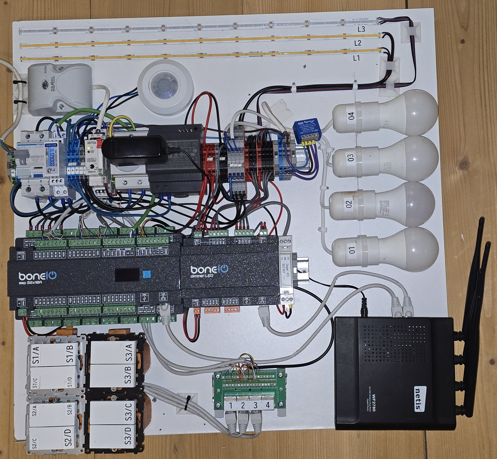

## Wstęp

Przed przystąpieniem do wdrożenia sterowników na inwestycji starałem się jak najwięcej problemów
rozwiązać z wyprzedzeniem - lokalnie, we własnym zakresie.
Dzięki temu czas spędzony u klienta mogłem poświęcić na konfigurację i uruchomienie,
a nie na zastanawianie się, jak zrealizować daną automatyzację.

W tym celu przygotowałem **zestaw doświadczalny** - kompaktową tablicę, na której mam zamontowane
rzeczywiste elementy używane na inwestycji. Pozwala mi ona testować logikę sterowania
w warunkach maksymalnie zbliżonych do rzeczywistych, bez potrzeby wyjazdu do klienta.

## Co wchodzi w skład zestawu

- sterowniki BoneIO (`ESP32 32x10A`, `dimmer LED`),
- router/modem,
- oprawki z żarówkami `O1-O4`,
- paski LED `L1 - L3`, w tym `L3` jako pasek RGB,
- sekcja przycisków: `S1` i `S2` - po dwa przyciski podwójne a `S3` - cztery przyciski pojedyncze,
- czujnik ruchu `Orno OR-CR-263` wraz z przekaźnikiem separacyjnym `Relpol SIR6W-220-240VAC/DC-R`,
- czujnik zmierzchu `Zamel WZM-01`,
- licznik energii `EASTRON SDM120M`,
- zegar RTC `DS1307` z baterią podtrzymującą (wykorzystany interfejs I2C),
- Shelly `Shelly 1 Gen4` do testowania integracji przez HTTP API,
- w puszkach instalacyjnych umieściłem także termometr `DS18B20`,
- mały patch panel/rozgałęźnik RJ45 opisany 1..4,
- elementy rozdzielcze (złączki WAGO), zasilacz 24 V i zabezpieczenie na szynie DIN.

## Do czego służy

Zestaw pozwala mi na:

- pisanie i testowanie skryptów ESPHome przed wdrożeniem,
- sprawdzenie logiki `on_multi_click` (SP/LP/VLP) na fizycznych przyciskach,
- weryfikację mechanizmu `packet_transport` (UDP) między sterownikami,
- testowanie integracji z zewnętrznymi urządzeniami (np. Shelly przez HTTP API),
- symulację scenariuszy takich jak `master_off` czy maszyna stanów w salonie.

Każda automatyzacja, zanim trafi na inwestycję, jest najpierw sprawdzana właśnie tutaj.

